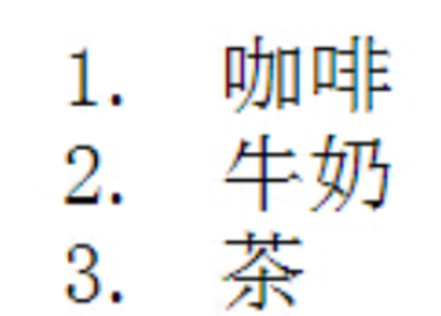

1. 
   下列选项中，说法不正确的是(B)

   A. 表格的主要作用是展示大量数据

   B. 列表分成三种：无序列表、有序列表和乱序列表

   C. 自定义列表中，dl和dt是父子关系

   D. 自定义列表中，dl和dd是父子关系


2. 关于列表下列说法不正确的是 (D)

   A. 列表分为有序列表，无序列表，定义列表

   B. 工作中写页面结构时，经常使用无序列表

   C. li标签可以当做容器，里边可以放其他标签

   D. ul中可以放li标签，也可以放其他标签


3. 关于列表下列说法正确的是(C)

   A. 列表只有序列表和无序列表

   B. 有序列表会按照一定的顺序排列，所以工作中经常使用

   C. li标签里边可以放a标签，也可以放ul标签

   D. ul中可以放li标签，也可以放a标签


4. 下面选项中能够完成下面图片所示内容的是 (B)



​	A. 

```
<ul><li>咖啡</li><li>牛奶</li><li>茶</li></ul>
```

​	B. 

```
<ol><li>咖啡</li><li>牛奶</li><li>茶</li></ol>
```

​	C. 

```
<dl> <dt>咖啡</dt> <dd>牛奶</dd><dd>茶</dd></dl>
```

​	D. 以上都正确


5. 下列选项中，说法不正确的是(C)

   A. 当列表中有列表标题时，我们可以使用自定义列表

   B. 无序列表经常在导航结构中应用

   C. 无序列表中li代表列表项目，一个ul里面只能放一个li标签

   D. 有序列表标签为ol标签


6. 以下选项对表格标签描述正确的是(A)

   A. table代表表格，tr代表行，td代表单元格

   B. tr代表表格，table代表行，td代表单元格

   C. table代表表格，tr代表单元格，td代表行

   D. table代表单元格，tr代表表格，td代表行


7. 
   在网页中，想要收集用户信息，应该使用哪类标签(A)

   A. 表单标签

   B. 列表标签

   C. 表格标签

   D. 段落标签


8. 下列选项中哪那个不是input的type值为 (D)

   A. 

   ```
   <input type="text" />
   ```

   B. 

   ```
   <input type="file" />
   ```

   C. 

   ```
   <input type="radio" />
   ```

   D. 

   ```
   <input type="img" />
   ```


9. 下列选项中，说法正确的是(A)

   A. input中不同的type属性值可以决定表单的不同类型

   B. type为radio的时候代表当前表单为复选框

   C. type为checkbox的时候代表当前表单为单选框

   D. type的默认值为password


10. 下列选项中，说法不正确的是(A)

    A. input输入框表单想要设置默认填写内容需要添加name属性

    B. checkbox复选框想要默认选中可以添加checked属性

    C. radio单选按钮想要默认选中可以添加checked属性

    D. select option 下拉选项框想要默认选中可以给option添加selected属性


