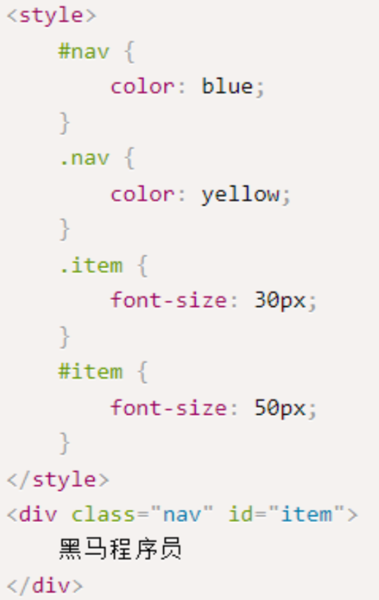
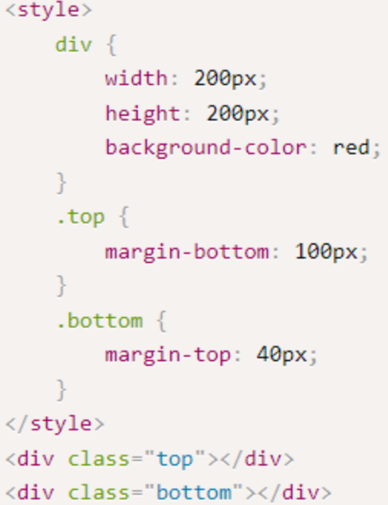
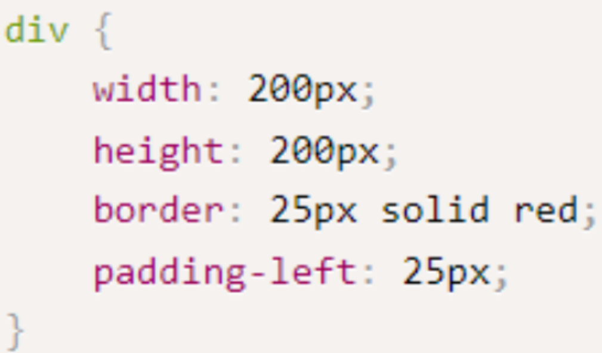

1. 阅读以下代码片段，描述正确的代码效果选项是（B）



​		A. 蓝色文字，字体大小30px;

​		B. 黄色文字，字体大小50px;

​		C. 黄色文字，字体大小30px;

​		D. 蓝色文字，字体大小50px;


2. 以下描述中，优先级顺序正确的是（B）

   A. 继承性 < 类名 < id < 通配符 < 标签 < 行内式 < !important

   B. 继承性 < 通配符 < 标签 < 类名 < id < 行内式 < !important

   C. 继承性 < 类名 < 通配符 < 标签 < id < 行内式 < !important

   D. 继承性 < 通配符 < 标签 < id < 行内式 < 类名 < !important


3. 给一个div设置边框，上边不要边框，正确的是（A）

   A. 

   ```css
   div { border: 1px solid #000; border-top:none; }
   ```

   B. 

   ```css
   div { border: 1px solid #000; border-right:none; }
   ```

   C. 

   ```css
   div { border: 1px solid #000; border-bottom:none; }
   ```

   D. 

   ```css
   div { border: 1px solid #000; border-left:none; }
   ```


4. 需要控制盒子中内容与边框的距离，可以用哪个属性（C）

   A. content

   B. border

   C. padding

   D. margin


5. 下列选项中正确设置CSS3盒模型并且实际宽度是200px的div是(C)

   A. 

   ```css
   div { box-sizing:content-box;width:200px; height:100px; padding:20px; }
   ```

   B. 

   ```css
   div { box-sizing:content-box; height:100px; border:3px solid #f40; padding:20px; }
   ```

   C. 

   ```css
   div { box-sizing:border-box;width:200px; height:100px; border:3px solid #f40; padding:10px; }
   ```

   D. 

   ```css
   div{ width:200px; height:100px; border:3px solid #f40; padding:20px; }
   ```


6. 以下选项中，哪个属性是控制盒子之间的距离的（C）

   A. border

   B. content

   C. margin

   D. padding


7. 阅读以下代码片段，以下正确的描述是（A）

​		

​		A. 盒子之间距离为100px；

​		B. 盒子之间距离为40px；

​		C. 盒子之间距离为140px；

​		D. 盒子之间距离为60px；


8. 如果发生了包含塌陷，那么以下哪种方式不可以解决（B）

   A. 给父盒子添加顶部border

   B. 给父盒子添加顶部margin

   C. 给父盒子添加顶部padding

   D. 给父盒子设置overflow：hidden


9. 阅读以下代码，div盒子其实的真实宽高是多少（B）



​		A. 宽200 高200

​		B. 宽275 高250

​		C. 宽250 高250

​		D. 宽275 高200