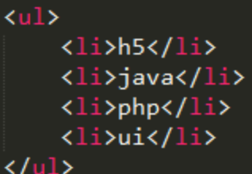

1. 关于结构伪类下列说法错误的是(D)

   A. first-child可以选取父元素里面的首个子元素

   B. last-child 可以选取父元素里面的最后一个子元素

   C. nth-child(n) 匹配属于其父元素的第 N 个子元素

   D. nth-child(n) 中n是负数或零也有效果

2. 结构如下图所示 让h5变红色，下列代码正确的是(A)

​	A. li:first-child{color: red;}

​	B. li:last-child{ color: red; }

​	C. li:nth-child {color: red;}

​	D. li:first-childen{color: red; }

3. 下列关于伪元素说法正确的是(A)

   A. 伪元素before和after使用时必须写content属性

   B. 伪元素和伪类没有区别

   C. 伪元素是在当前标签外部添加

   D. before和after伪元素默认创建的是块级元素

4. 下列伪元素中可以在元素内前面和后面添加内容的伪元素是(C)

   A. :first-letter和:first-line

   B. :first-line

   C. ::before和::after

   D. :hover和:link

5. 关于flex布局主轴描述错误的是(  D )

   A： flex布局默认的主轴是X轴

   B： flex-direction取值为row，可以将主轴设置为X轴

   C： flex-direction取值为column，可以将主轴设置为Y轴

   D： flex-direction默认取值是column

6. 如何将flex布局的主轴设置为Y轴(  A  )

   A： flex-direction:column;

   B： flex-direction:row;

   C： flex-direction: row- reverse;

   D： flex-direction:column- reverse;

7. align-content如何实现侧轴方向子元素平分剩余空间排列(  C  )

   A： align-content:center;

   B： align-content:flex-start;

   C： align-content:space-around;

   D： align-content:flex-end;

8. 下列有关flex布局的相关属性描述错误的是(  D  )

    A： flex-direction属性可以控制弹性盒子中子元素的布局方向

    B： justify-content属性可以控制主轴对齐方式

    C： align-self属性可以控制单个子元素侧轴对齐方式

    D： align-items属性可以控制多行侧轴对齐方式

9. 父元素设置为 flex布局时，子元素的宽度和高度会(  C  )

    A： 宽度和高度不变

    B： 宽度变为100% ，高度由内容撑开

    C： 宽度由内容撑开，高度变为 100%

    D： 宽度和高度都变为 100%