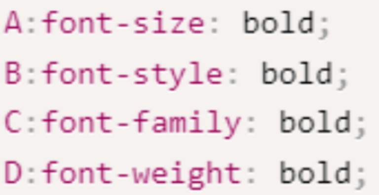

1. 以下选项对类名以及类选择器描述正确的是（ ）

   A. 只有部分标签才可以设置类名

   B. 设置类名使用name属性

   C. 类名选择器用.符号开头

   D. 类名选择器用#符号开头

2. 阅读以下代码，哪个是正确的文字加粗设置（ ）

A. A

B. B

C. C

D. D

3. 
   以下描述，关于字体属性效果正确的是（ ）

   A. font-size控制文字的粗细

   B. font-weight控制文字的大小

   C. font-family控制文字的字体库

   D. font-style控制文字的繁简体

4. 
   a标签本身自带下划线，如何清除（ ）

   A. text-decoration: overline;

   B. text-decoration: underline;

   C. text-decoration: line-through;

   D. text-decoration: none;

5. 以下哪个属性可以设置文本水平居中（ ）

   A. algin

   B. align

   C. textalign

   D. text-align

6. 针对行高的组成，以下描述哪个是正确的（）

   A. 行高由文字大小与上边距组成

   B. 行高由文字大小与下边距组成

   C. 行高由文字大小与上下边距组成

   D. 行高由上边距与下边距组成

7. 针对行高的作用，下面哪个选项是正确的（）

   A. 行高是为了让文字水平居中

   B. 行高可以控制文字的大小

   C. 行高可以控制文字的对齐方式

   D. 行高可以控制文字在盒子中的垂直位置

8. 阅读以下代码片段，哪些选项可以不正确的赋值颜色（ ）

   A. color: red;

   B. color: rgb(255, 0, 0);

   C. color: rgb(100%, 0, 0);

   D. color: #f00;

9. 针对不同css引入方式，以下描述中不正确的是（ ）

   A. 行内式的工作中最常用的方式，影响范围最广

   B. 内嵌式使用的频率不高，可以影响到当前一个页面的元素

   C. 外联式是工作中最常用的方法

   D. 行内式使用频率较低，只能影响到当前元素

10. 以下选项对id名以及id选择器描述不正确的是（ ）

    A. 任何标签都可以设置id名

    B. id名可以重复使用

    C. id选择器以#符号开头

    D. 一个标签只能有一个id名

